# NEMA17 Cycloidal Drive: Assembly Guide

Generated 2026-09-27 from `geometry/params.py` (commit `a9ecf30+dirty`). 19 steps. The PDF version has the same content.

| | |
|---|---|
| **Ratio** | 15 : 1, output turns opposite to the motor |
| **Housing** | Ø76 mm, 37.5 mm above the motor face |
| **Cycloid** | 16 pins on R25, 15 lobes, e = 1.2 mm, two discs at 180° |
| **Output** | 6 x M3 inserts on a Ø44 bolt circle |
| **Mounting** | 4 x M3 inserts in the cap face |
| **Prints** | 10 prints from 9 files, all PETG |

## Step 1: Check the printed parts

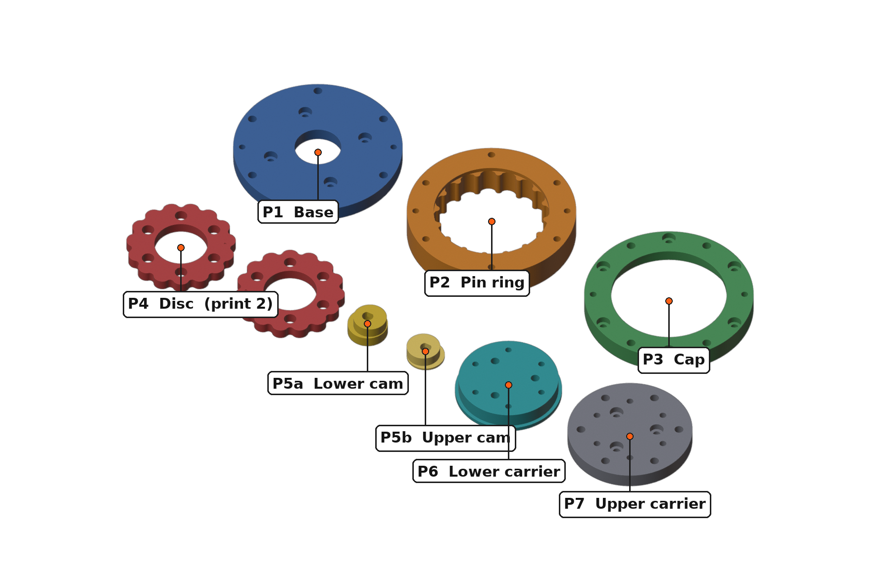

**You need:** 1× P1 base, 1× P2 pin ring, 1× P3 cap, 2× P4 disc, 1× P5a lower cam, 1× P5b upper cam, 1× P6 lower carrier, 1× P7 upper carrier

1. Lay out all 10 prints. Remove brims, and trim any elephant-foot flare from the bottom edges.
2. Run a fingertip around the 16 pins inside P2 and the lobes of both discs. Scrape off any blobs or seam zits; these are the surfaces that roll against each other.
3. Drop a dowel through each of the 6 Ø5.6 holes in both discs. It should pass with visible play. That play is the disc's 2.4 mm wobble and is intended.

**Check:** Both discs sit flat on the table without rocking. Nothing is warped or lifted at the corners.

**Tip:** The coupon (P0) is not part of the drive. Keep it: it records the hole fits your printer produced.

## Step 2: Check the hardware and tools

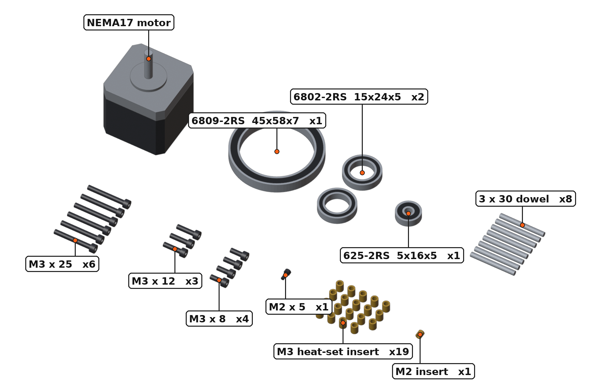

**You need:** 1× NEMA17 stepper motor, 1× 6809-2RS bearing, 2× 6802-2RS bearing, 1× 625-2RS bearing, 8× 3 x 30 mm dowel (2 spare), 6× M3 x 25 screw, 3× M3 x 12 screw, 4× M3 x 8 screw, 1× M2 x 5 screw, 19× M3 heat-set insert, 1× M2 heat-set insert

**Tools:** Soldering iron with an insert tip, 2.5 mm and 1.5 mm hex keys, bench vise or clamp, a flat scrap board, calipers, printer paper (for a shim), PTFE or white-lithium grease.

1. Measure the motor shaft from the mounting face to the tip. It needs to be at least 23 mm. If it is shorter, leave out the 625-2RS bearing in step 5.
2. Check each bearing turns smoothly. Measure the 6809-2RS's outside diameter: it should read 58.00 mm.
3. Sort the screws by length now. The M3 x 25 and M3 x 12 look alike at a glance.

**Check:** 8 dowels, 13 M3 screws, 1 M2 screw, 20 inserts, 4 bearings.

**Tip:** A 1.5 mm hex key fits the M2 set screw; 2.5 mm fits every M3 socket-head screw.

## Step 3: Install the heat-set inserts

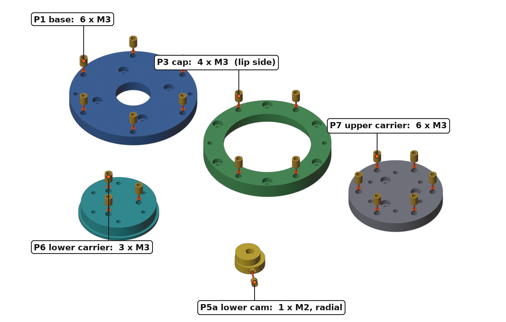

**You need:** 19× M3 heat-set insert, 1× M2 heat-set insert

**Tools:** Soldering iron with an insert tip (a fine tip for the cam's M2 insert).

1. Heat the iron to about 240 °C for PETG (about 210 °C for PLA).
2. Set each insert on its hole and let the iron sink it straight down until it is flush with the surface. Guide it; don't push hard.
3. P1 base: 6 inserts in the flat top face (the face without the round motor recess).
4. P3 cap: 4 inserts in the face with the narrow lip. P6 lower carrier: 3 inserts in the end opposite the wide shoulder.
5. P7 upper carrier: 6 inserts in the wide flange face. P5a lower cam: 1 M2 insert, sideways into the collar, at the bottom of the small counterbore.

**Check:** Every insert is flush, or up to 0.2 mm below the surface, and none is tilted. Run a screw into each one to confirm the thread is straight.

**Tip:** If an insert goes in crooked, reheat it at once and press it square with a flat piece of metal. The cam's M2 insert sits deep in its counterbore, so use a fine tip.

## Step 4: Press the 6802-2RS bearings into the discs

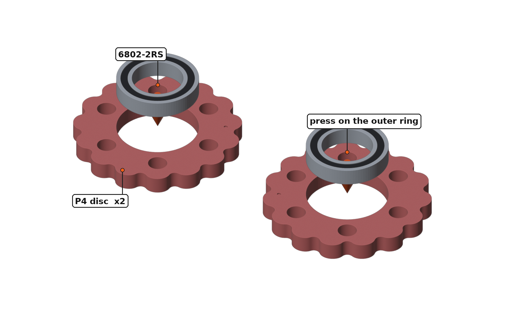

**You need:** 2× 6802-2RS bearing (15 x 24 x 5), 2× P4 disc

1. Lay a disc flat on a hard surface and start a bearing square in its Ø24 bore.
2. Press it in with a flat board or a vise jaw, pushing only on the bearing's outer ring, until it is flush with both faces. Disc and bearing are both 5 mm thick.
3. Repeat with the second disc. The two discs are identical at this point.

**Check:** Each bearing is flush on both sides, its inner ring spins freely, and the disc still sits flat.

**Tip:** Too tight to press by hand? Chill the bearing in the freezer for 10 minutes. Too loose? Reprint the discs with a smaller bearing_press in params.py.

## Step 5: Press the 625-2RS into the lower carrier

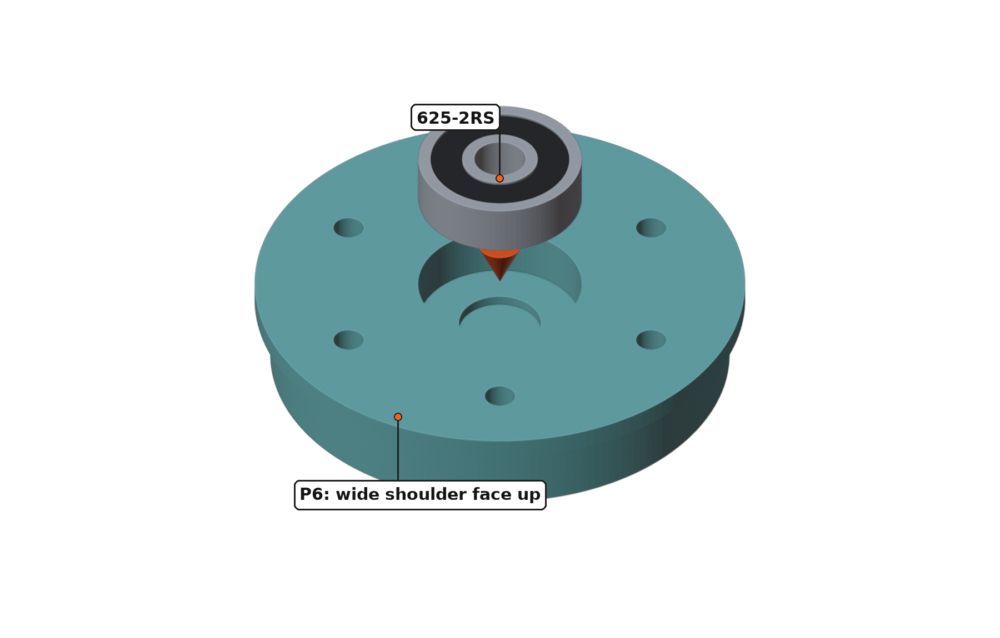

**You need:** 1× 625-2RS bearing (5 x 16 x 5), 1× P6 lower carrier

1. Turn P6 so its wide shoulder faces up. The Ø16 pocket is in the middle of that face.
2. Press the bearing into the pocket, pushing on its outer ring, until it bottoms out flush with the face.
3. Motor shaft shorter than 23 mm (step 2)? Skip this bearing.

**Check:** The bearing is flush with the shoulder face and spins freely.

**Tip:** This bearing catches the tip of the motor shaft, so the cams can't wobble on it.

## Step 6: Press in the output pins

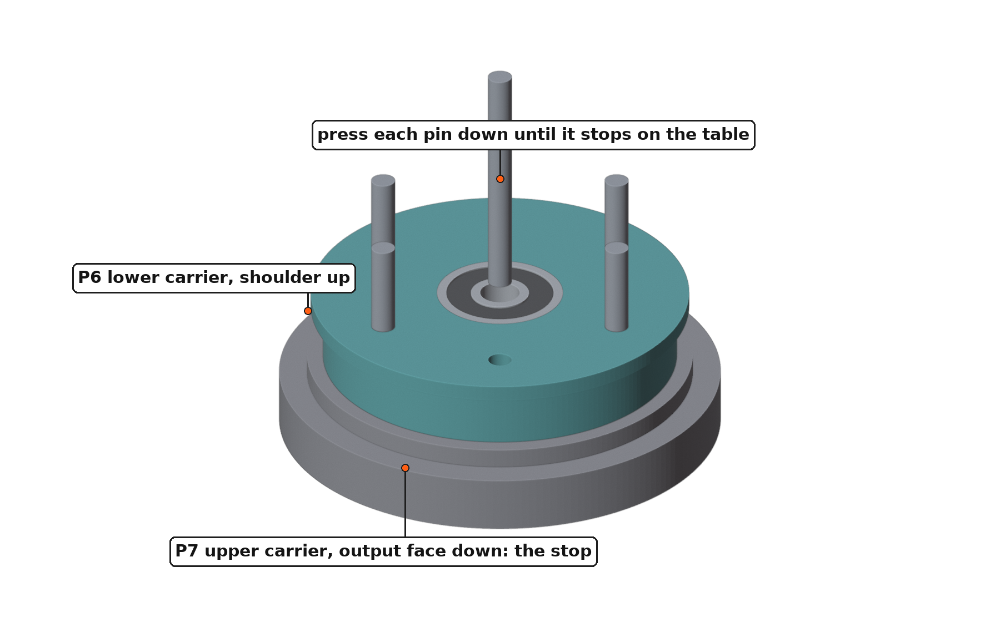

**You need:** 6× 3 x 30 mm dowel, 1× P6 (from the last step), 1× P7 upper carrier (as a gauge)

1. Lay P7 output-face down on a flat, hard surface. It is exactly 9.5 mm thick, which is how far the pins must stick out of P6's insert face.
2. Set P6 on it, shoulder up, with its 6 pin holes over P7's 6 holes. The screw holes line up too.
3. Press each dowel down through P6 with a vise or a flat punch until it stops on the table, then lift P6 off P7.

**Check:** All 6 pins stick out 11.5 mm from the shoulder face and 9.5 mm from the other face, parallel to each other.

**Tip:** Press straight. A pin that goes in at an angle will bind in the discs later. Pull it and press it again.

## Step 7: Mount the lower cam on the motor

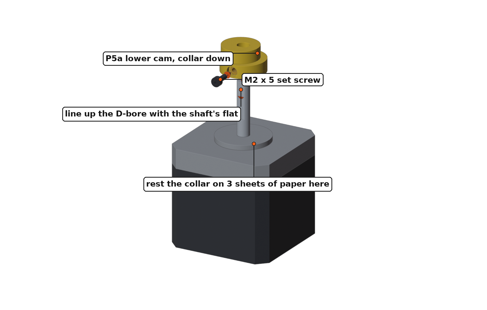

**You need:** 1× P5a lower cam (with its M2 insert), 1× M2 x 5 screw, 1× NEMA17 motor, 3× sheets of printer paper (shim)

1. Slide P5a onto the motor shaft, collar first. The top 3 mm of its bore is D-shaped: line that up with the flat on the shaft.
2. Lay three sheets of printer paper (about 0.3 mm) on the motor's round boss, and rest the collar on them.
3. Thread the M2 x 5 into the collar's insert and tighten it against the shaft with a 1.5 mm key. Pull out the paper.

**Check:** The cam doesn't turn or slide on the shaft, and there's a 0.3 mm gap between the collar and the boss.

**Tip:** The cam's height sets where the discs run. Getting the shim right matters more than tightening hard.

## Step 8: Fit the base to the motor

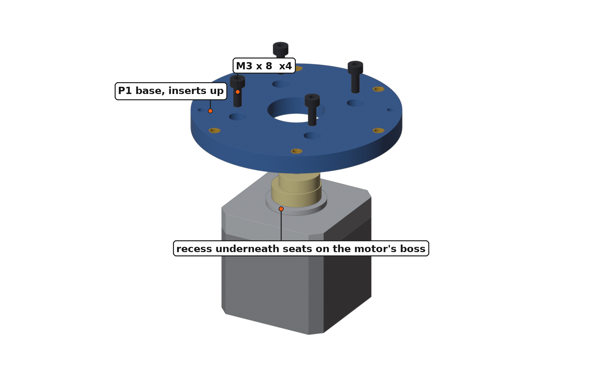

**You need:** 1× P1 base (with 6 inserts), 4× M3 x 8 screw

1. Lower the base over the cam, insert face up, so the round recess underneath seats on the motor's boss.
2. Line up the four counterbored holes with the motor's threaded holes.
3. Fit the four M3 x 8 screws with a 2.5 mm key: snug, not tight. They clamp plastic.

**Check:** The base sits flat on the motor, the screw heads are below the top surface, and the cam turns freely inside the base's bore.

**Tip:** If a screw bottoms out before it is snug, your motor's threads are shallow. Use M3 x 6 instead.

## Step 9: Press in the alignment pins

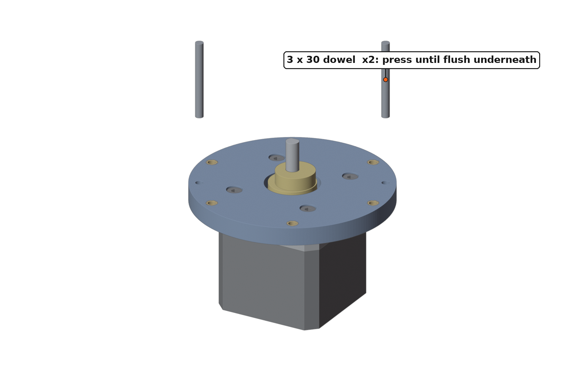

**You need:** 2× 3 x 30 mm dowel

1. Press a dowel into each of the two small holes near the rim, on opposite sides of the base.
2. Push until the bottom end is flush with the underside of the base. The holes sit outside the motor body, so the pin can pass straight through.

**Check:** About 23 mm of each pin stands above the base, and both are vertical.

**Tip:** These two pins line up the ring and the cap, and with them all six screw holes.

## Step 10: Fit the pin ring

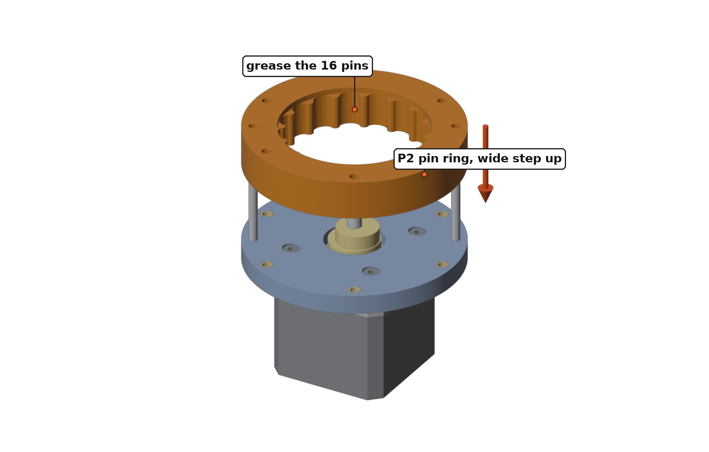

**You need:** 1× P2 pin ring, Grease

1. Wipe a thin coat of grease on the 16 pins inside the ring.
2. Lower the ring over the two alignment pins, with the wider stepped opening facing up.
3. Seat it flat on the base.

**Check:** The ring sits flush on the base and its six screw holes line up with the base's inserts.

**Tip:** Thin is right: grease only has to fill the gaps between lobes and pins. Extra just gets pushed out.

## Step 11: Fit the first disc

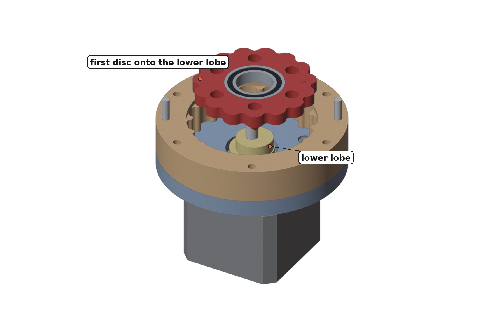

**You need:** 1× Disc with 6802-2RS (from step 4)

1. Lower a disc onto the lower cam lobe so its bearing slides over the lobe.
2. Turn the disc slightly until its lobes drop between the ring's pins. It only goes all the way down when the lobes mesh.
3. Wipe a little grease on its top face.

**Check:** The disc's top face is level with the top of the cam lobe, and turning the motor shaft by hand makes the disc wobble around the pins without binding.

**Tip:** If it won't drop, turn the motor shaft a few degrees; the lobe may be pushing the disc against a pin.

## Step 12: Fit the upper cam

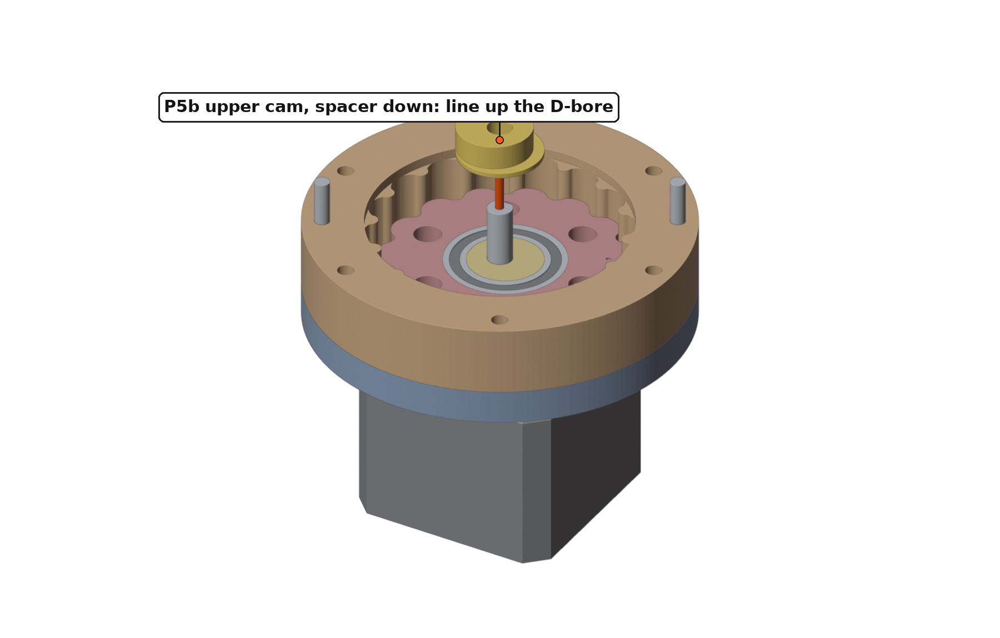

**You need:** 1× P5b upper cam

1. Line up P5b's D-shaped bore with the flat on the shaft and slide it down, spacer end first.
2. Push it down until the spacer rests on the lower cam lobe.

**Check:** The two lobes point in opposite directions (the flat forces this), and P5b turns with the shaft.

**Tip:** Nothing clamps P5b. The 625-2RS in the carrier (step 17) stops it from riding up.

## Step 13: Fit the second disc, turned 180°

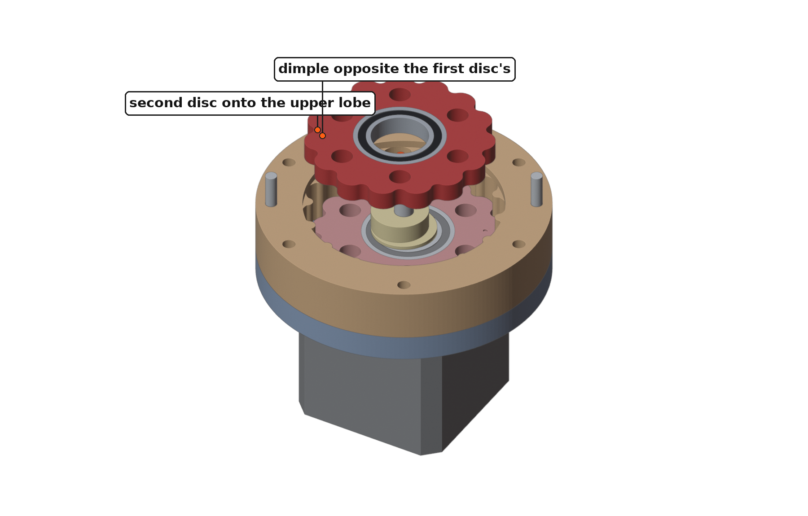

**You need:** 1× Disc with 6802-2RS (from step 4)

1. Turn the second disc so its small dimple is on the opposite side from the first disc's dimple.
2. Lower it onto the upper lobe and let its lobes drop between the pins.
3. Look down through the 6 holes: the two discs' holes overlap, offset by 2.4 mm.

**Check:** Both discs are down, and the shaft turns by hand with smooth, even resistance.

**Tip:** Only a few orientations let all 6 holes clear the output pins in step 17. Dimples on opposite sides is one of them.

## Step 14: Press the 6809-2RS into the cap

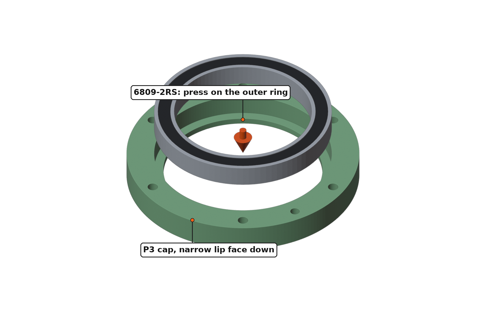

**You need:** 1× P3 cap (with 4 inserts), 1× 6809-2RS bearing (45 x 58 x 7)

1. Lay the cap on a flat surface with its narrow lip face down, so the Ø58 bore opens upward.
2. Press the bearing in evenly, pushing on its outer ring, until it seats against the lip.

**Check:** The bearing is flush with the cap's face and turns freely.

**Tip:** A flat board across the bearing works: until it's seated, the bearing sits proud of the cap.

## Step 15: Fit the cap onto the lower carrier

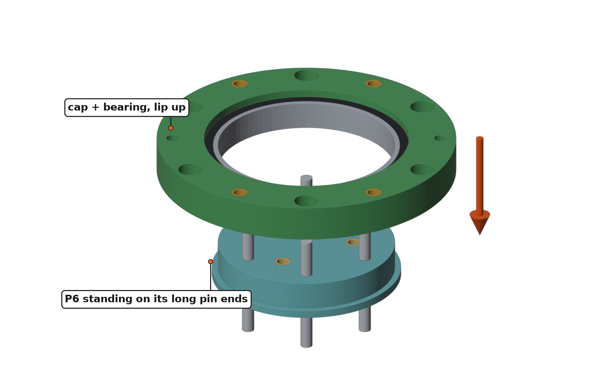

**You need:** 1× P6 with pins and bearing (steps 5 and 6), 1× Cap with bearing (last step)

1. Stand P6 on the ends of its pins, long ends down (11.5 mm side).
2. Turn the cap lip-side up and lower it over P6, so the bearing's inner ring slides onto P6's hub.
3. Push down until the inner ring rests on P6's shoulder.

**Check:** P6 turns freely in the bearing, and its short pin ends stick up through the cap's lip.

**Tip:** Push only on the bearing's inner ring (or on the cap evenly). Levering on one edge can crack the lip.

## Step 16: Fit the upper carrier

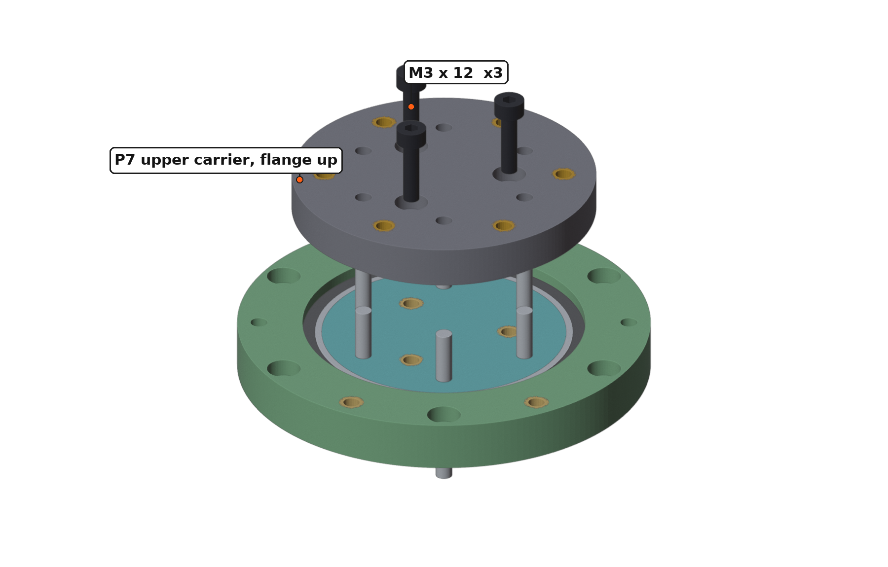

**You need:** 1× P7 upper carrier (with 6 inserts), 3× M3 x 12 screw

1. Keep the assembly standing on its pins.
2. Lower P7 over the 6 short pin ends, flange up, so its hub passes through the cap's lip.
3. Fit the 3 M3 x 12 screws into P6's inserts and tighten them evenly. This clamps the bearing's inner ring between P6 and P7.

**Check:** The pin ends are flush with P7's face, and the carrier turns freely in the cap with no rocking.

**Tip:** If the carrier binds after tightening, the screws are pulling P6 and P7 crooked. Loosen them and tighten again in rotation.

## Step 17: Lower the output assembly onto the drive

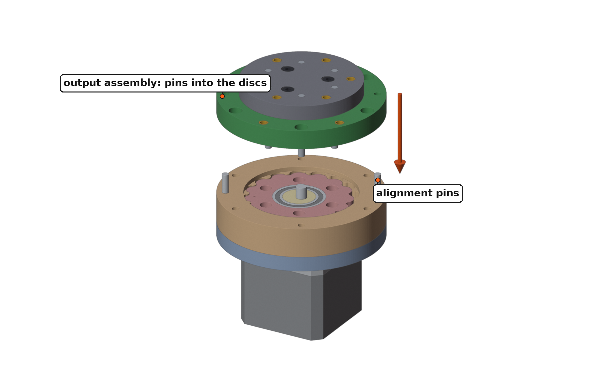

**You need:** 1× Output assembly (last step)

1. Lower the assembly straight down over the two alignment pins.
2. The 6 output pins go into the discs' holes and the 625-2RS onto the shaft tip. Turn the output flange slightly until the pins drop in.
3. Seat the cap flat on the ring.

**Check:** The cap sits flat. Turning the output flange by hand turns the motor shaft 15 times as fast, the opposite way.

**Tip:** If the pins won't find the holes, rock the motor shaft back and forth a few degrees while pressing lightly on the flange.

## Step 18: Fit the housing screws

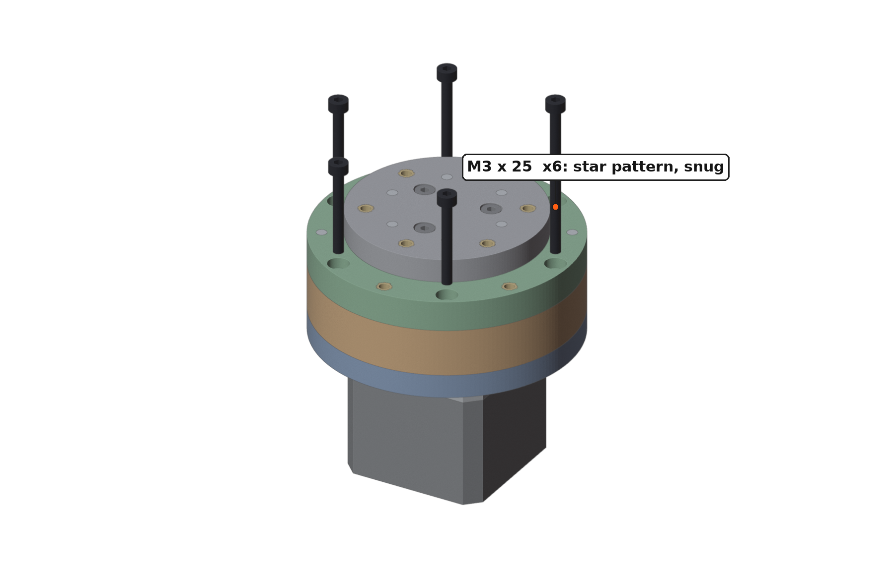

**You need:** 6× M3 x 25 screw

1. Fit the 6 M3 x 25 screws through the cap and ring into the base's inserts.
2. Tighten them in a star pattern, a little at a time, and stop at snug.
3. Turn the output by hand through a full turn (15 motor turns).

**Check:** It turns smoothly the whole way round, with no tight spots and no clicking.

**Tip:** A tight spot that repeats once per output turn usually means one screw is over-tightened and squeezing the ring. Back it off a little.

## Step 19: Mount it and run it

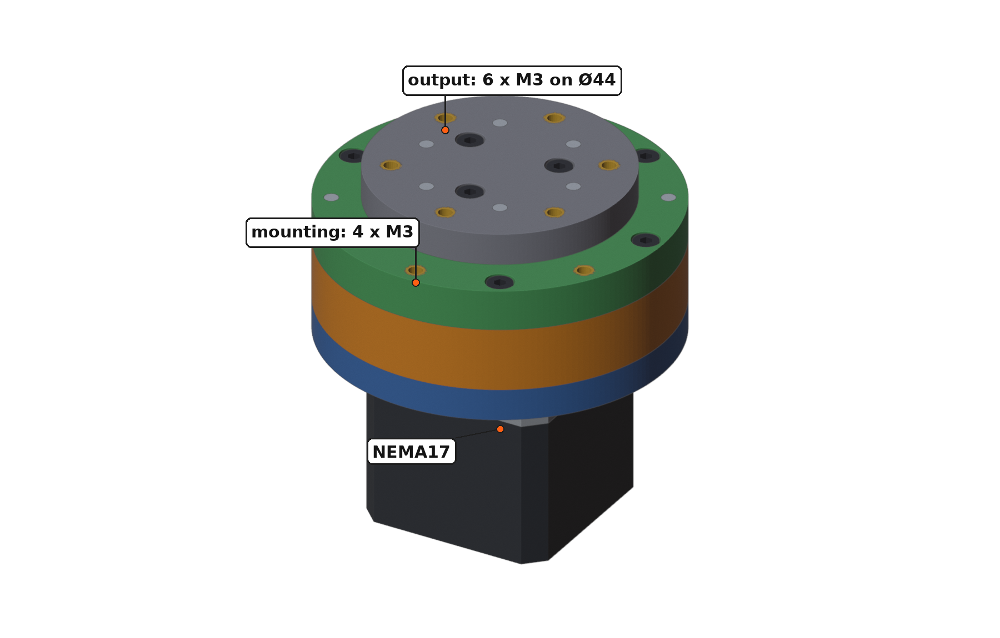

1. Mount the drive by the 4 M3 inserts in the cap face. The bracket needs a Ø60 or larger hole for the output flange.
2. Bolt your load to the 6 M3 inserts in the output flange (Ø44 bolt circle).
3. 15 motor turns make 1 output turn, and the output turns the opposite way to the motor.

**Check:** Run the motor slowly first (about 60 rpm) and listen for clicks or tight spots before loading it.

**Tip:** Re-grease the pins after the first hour of running, once the high spots have worn in.
